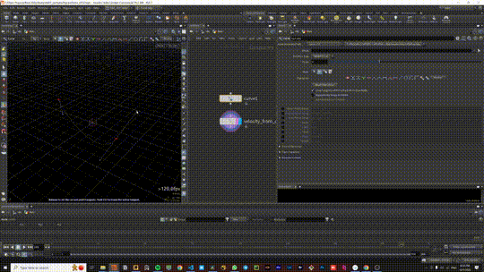
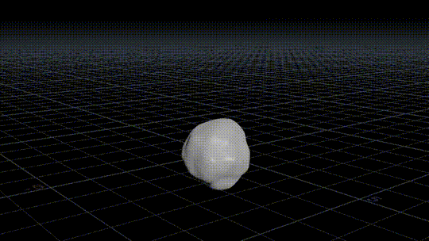
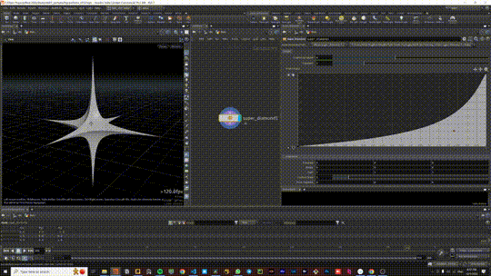

# ntLib
This is an open-source library of Houdini HDA's (Houdini Digital Assets)
It includes tools for simulating dynamics, procedural generation and generative art.

## About 
This is my way to give back to the community. I'm sharing my development with you so we can all learn from it. A lot of the tools are discovered through RnD and the study of math.

I welcome you to join the adventure and share your own expirmients

* Discord: https://discord.gg/z5DpSC9U
* Youtube: https://www.youtube.com/channel/UCe6hY7_rXJ-iQrdDT0ZiyRw
* Website: https://www.nitzan-tregerman.com/

## Contribution

You can contribute to the project in the following ways

- Create your own thing - use the tools in the library to explore math, procedural generation and generative art.
- Join the community - join to the discord and share your stuff.
- Optimization & debugging - a list of issues will be avilable in the GitHub page.

.

.

# Tools

## Extrude Subidivision

This node takes an input polygon surface, and divides each face to create a “Extrude shaped” surface. It is similar to the Subdivide node in that it divides up all or part of a surface allowing you to increase areas of local detail.

Explainer video here:
https://vimeo.com/775089386

.

.

## Velocity From Curves

A utility tool that generates a velocity field from a curve, allows to control the following forces:

* Follow force - pushing along the curve tangent
* Suction force - push velocity toward nearest point on the curve
* Orbit force - push velocity around the curve
* Curl Noise - adds Curl noise to the velocity

.

.

# Upcoming Tools

## 2D Smoke Solver (Beta)
a SOP solver that simulates smoke in a 2D Plane,
this method can be rendered as jpeg / png pictures and then used as texture for shading.

Because this simulation is two dimentional its exectuted much faster then the 3D smoke solver, allowing you to simulate on higher resolution.
Raisng substeps helps to get better collision and density loss

.

.

## SDF Growth Solver (Beta)

A tool that simulates a growth of an SDF field by advecting it along a velocity field.

advection is masked by the curvature of the SDF, resulting in different behavior depending on the parameters.

Advection direction can be guided by a curve / velocity field

.

.

## 3D Chlandi Noise (Alpha)

This node generates a 3D Chlandi noise pattern that can be created as an attribute in the SOP context.

This noise is based on the article [Chladni Figures Revisited: A Peek Into The Third Dimension](chrome-extension://efaidnbmnnnibpcajpcglclefindmkaj/https://ms-math-computer.science/preprint/2016_SRP_Chladni.pdf). I tried to copy the formula but there are still some problems with  the frequancy and evolution parameters.

to find more about chlandi noise look at the following videos:

[Yoichi Ochiai - Three-Dimensional Mid-Air Acoustic Manipulation](https://www.youtube.com/watch?v=odJxJRAxdFU) 

[Physics Girl - Singing plates - Standing Waves on Chladni plates](https://www.youtube.com/watch?v=wYoxOJDrZzw)

.

.

## Super Diamond (Beta)
A tool that remaps every axis with a ramp,
by default it generates the "super diamond" which is a remaped octahedron.

.

.

## Points from Curves (Beta)
an expiriment to test the limits of VEX.

The challange is to animate points along a curve while only using a single wrangler

I attempted to make everything into a single wrangler

.

.

## DOP wrangler (Beta)
Just like the SOP "Solver" node is a glorified "SOP Solver" DOP, the "DOP wrangler" is a glorified geometry wrangler.
i created it just to test if a i can make a solver that is even simpler then the "SOP Solver"

Suppsodly "geometry wrangler" DOP node should exectue faster then the "SOP Solver" DOP node, as it doesnt have to bind all the data of the source geometry.

I think that sharing this curiosity might open an interesting discussion about what are DOP's and how we can optimize them.

